# of-example-gallery
Gallery of OpenFrameworks v0.9.0 Example Projects

- [3d](3d/README.md)

  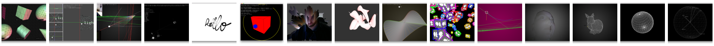

- [addons](addons/README.md)

  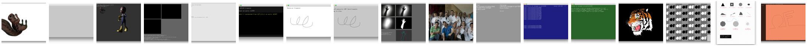

- [communication](communication/README.md)

  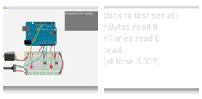

- [empty](empty/README.md)

  

- [events](events/README.md)

  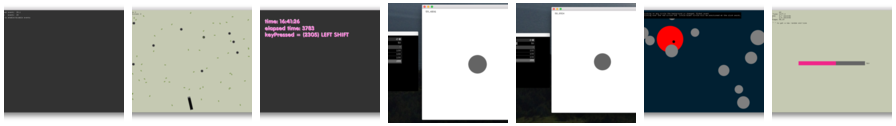
  
- [gl](gl/README.md)
 
  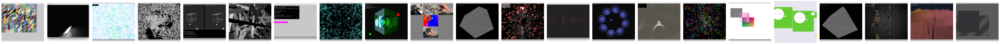  

- [graphics](graphics/README.md)

  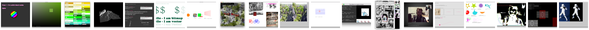  

- [gui](gui/README.md)

  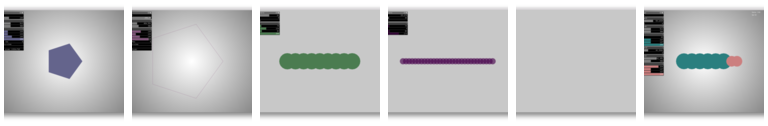  
  
- [math](math/README.md)

  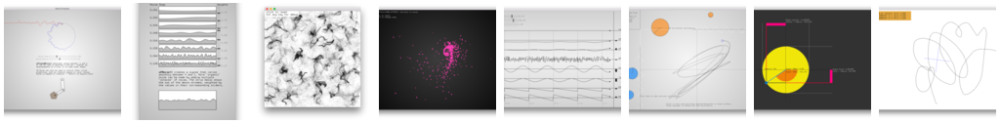

- [sound](sound/README.md)

  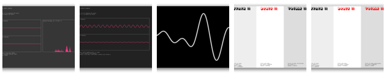

- [utils](utils/README.md)

  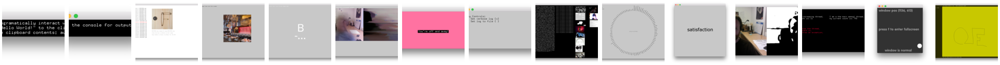

- [video](video/README.md)

  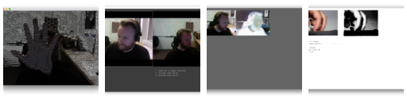

