[< back to main](../README.md)

#examples/addons

3DModelLoaderExample

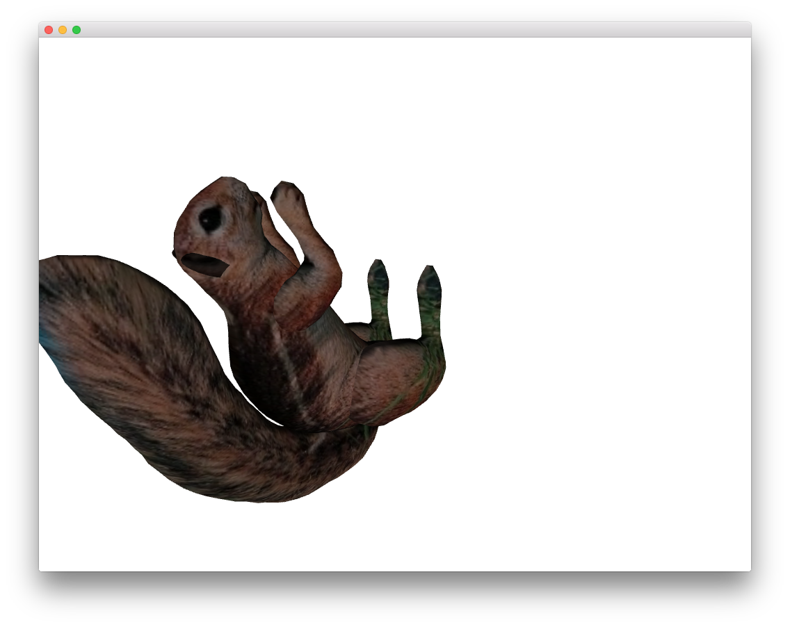

allAddonsExample

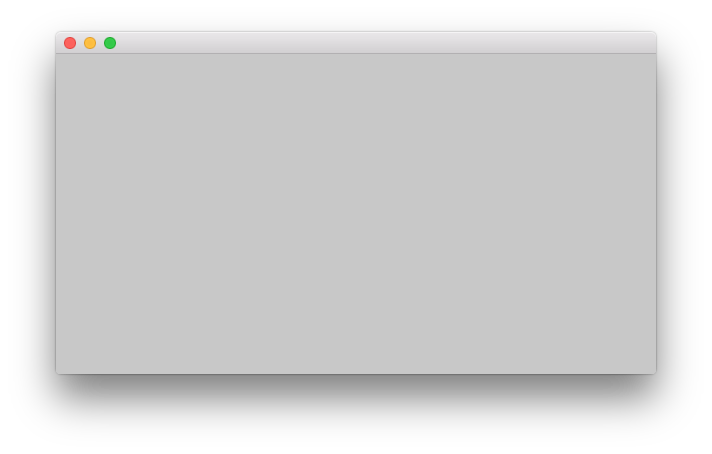

assimpExample

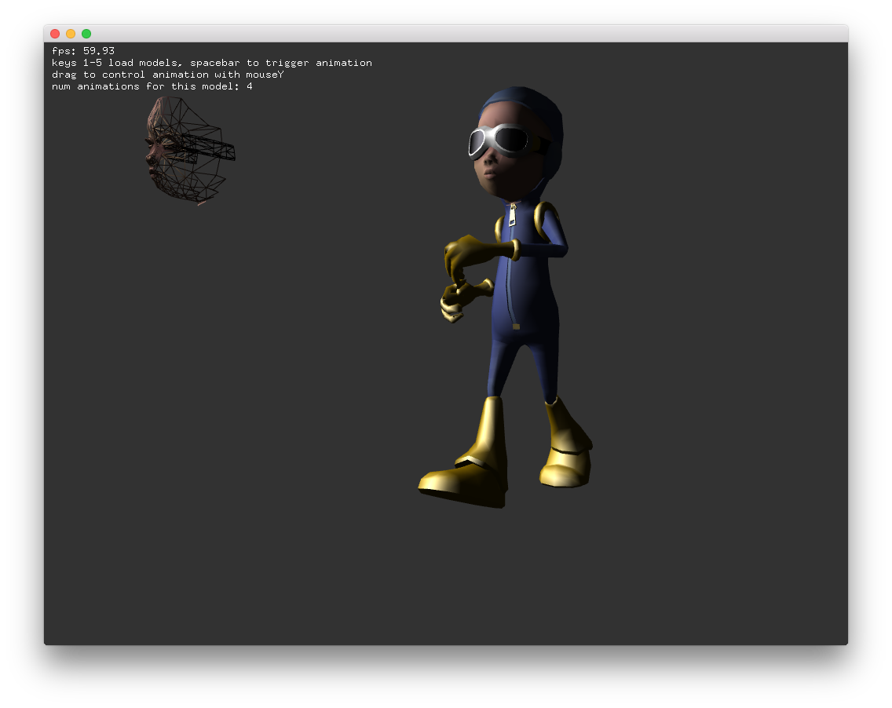

kinectExample

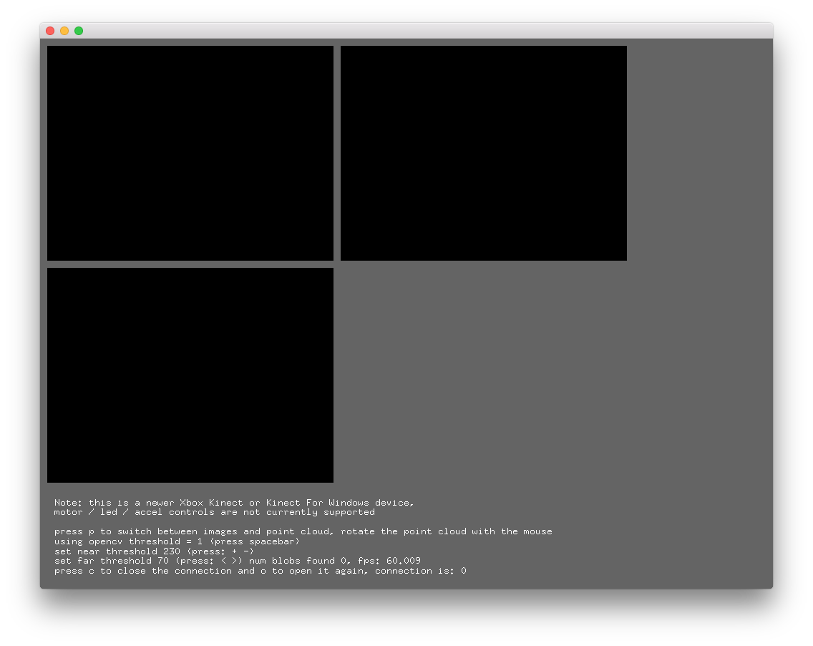

networkTcpClientExample

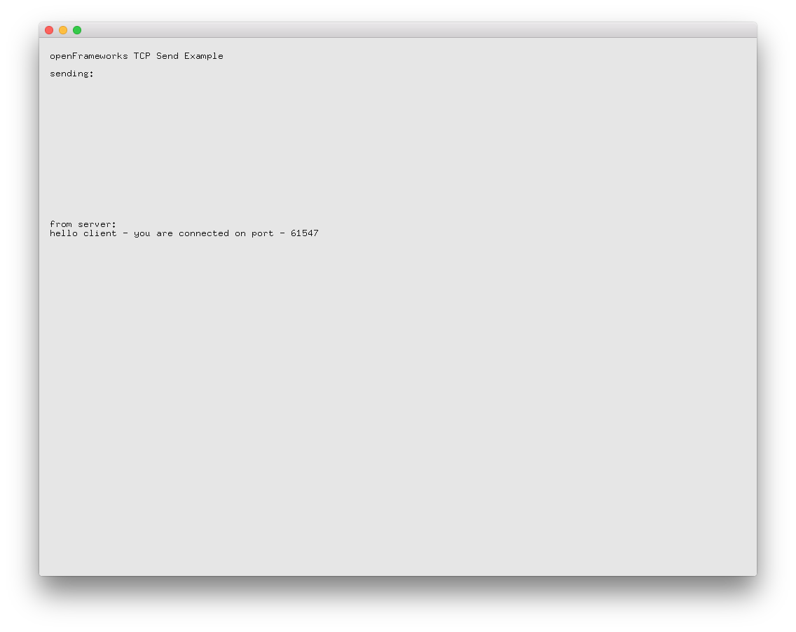

networkTcpServerExample

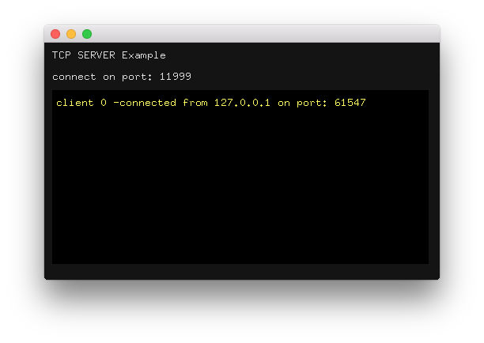

networkUdpReceiverExample

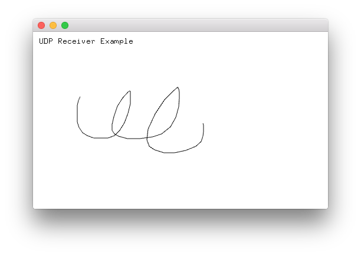

networkUdpSenderExample

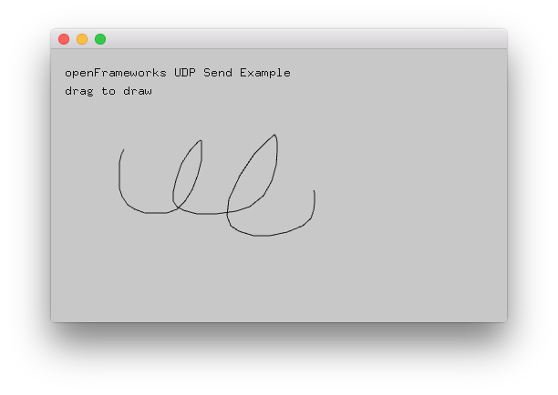

opencvExample

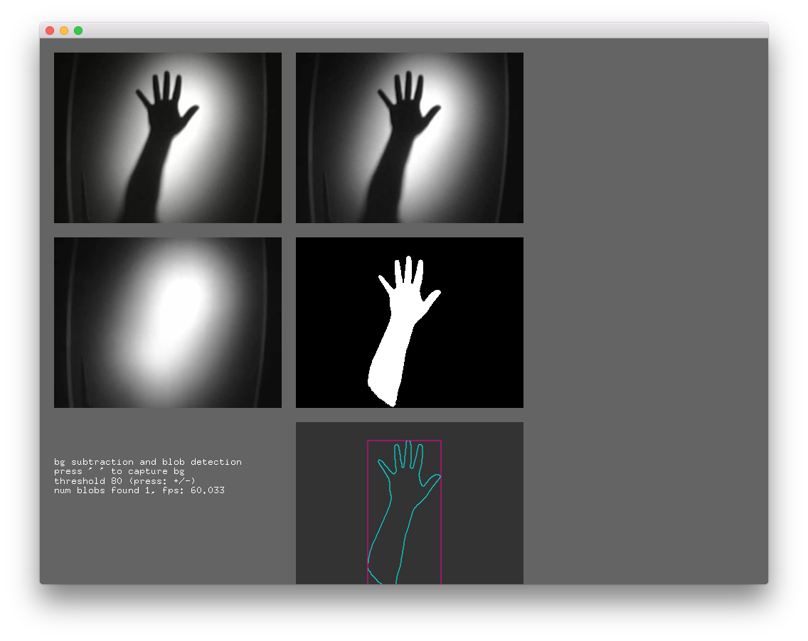

opencvHaarFinderExample

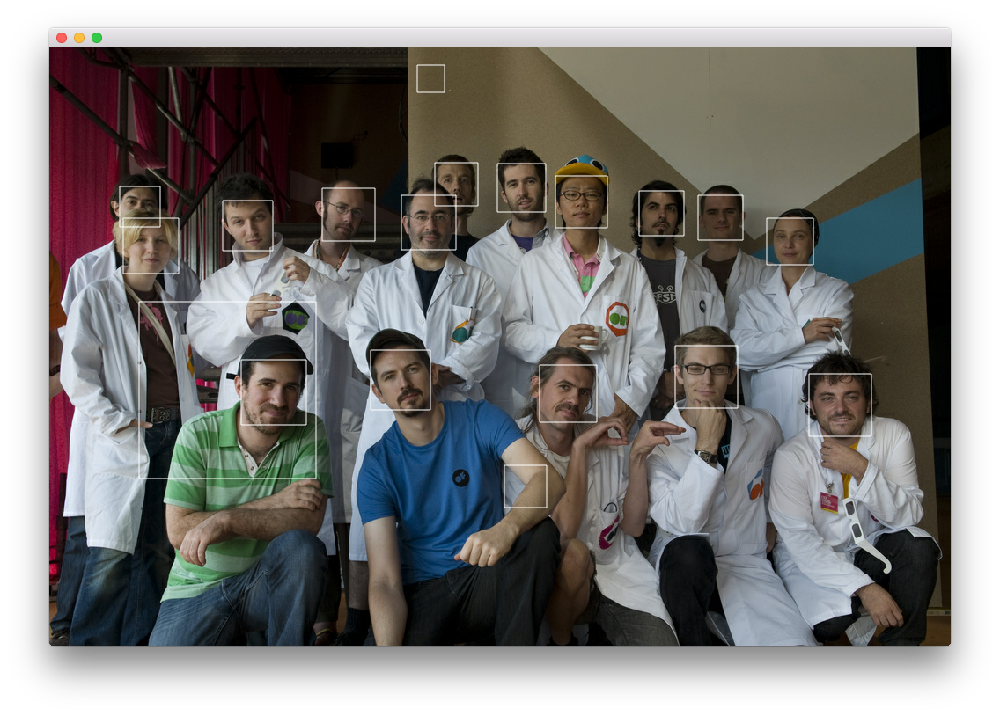

oscChatSystemExample

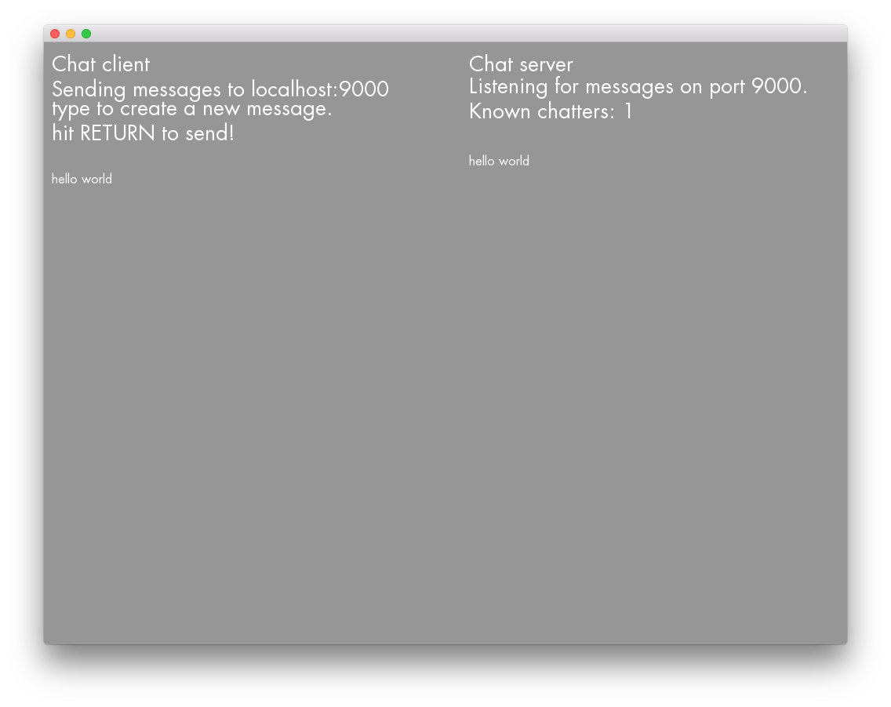

oscReceiveExample

oscSenderExample

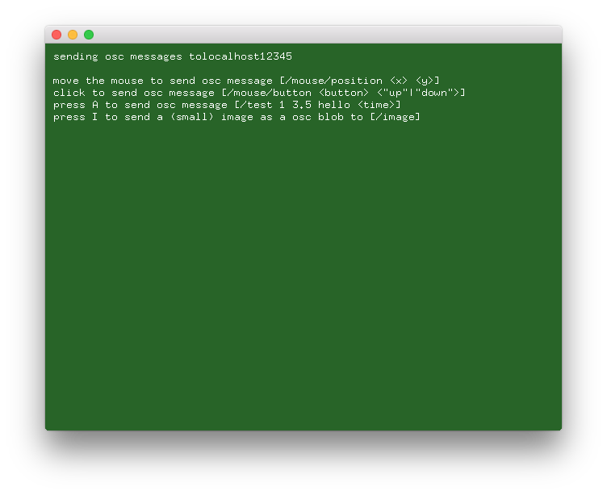

svgExample

threadedImageLoaderExample

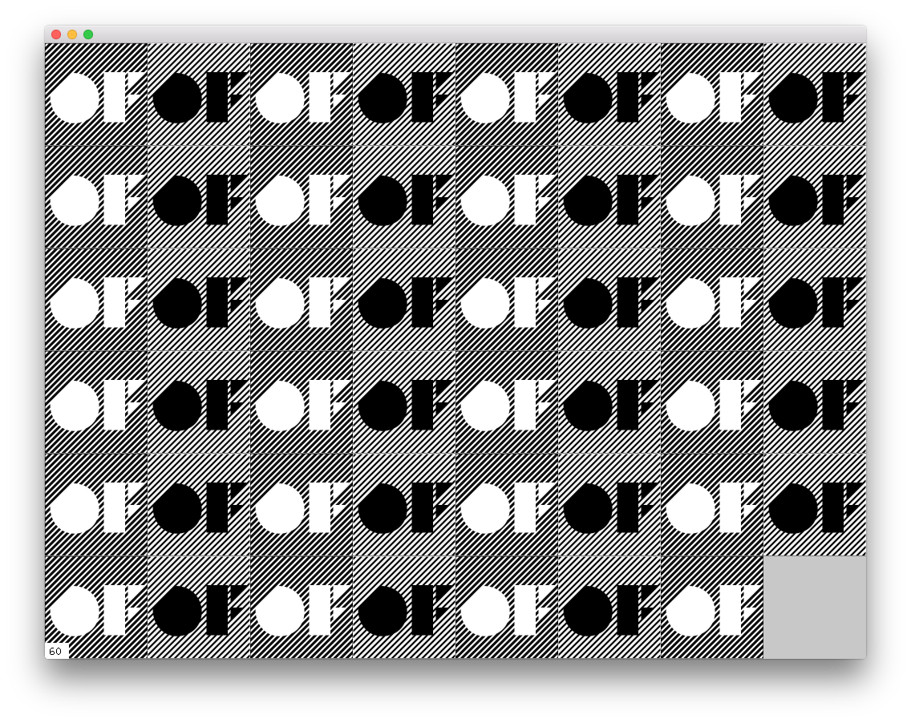

vectorGraphicsExample

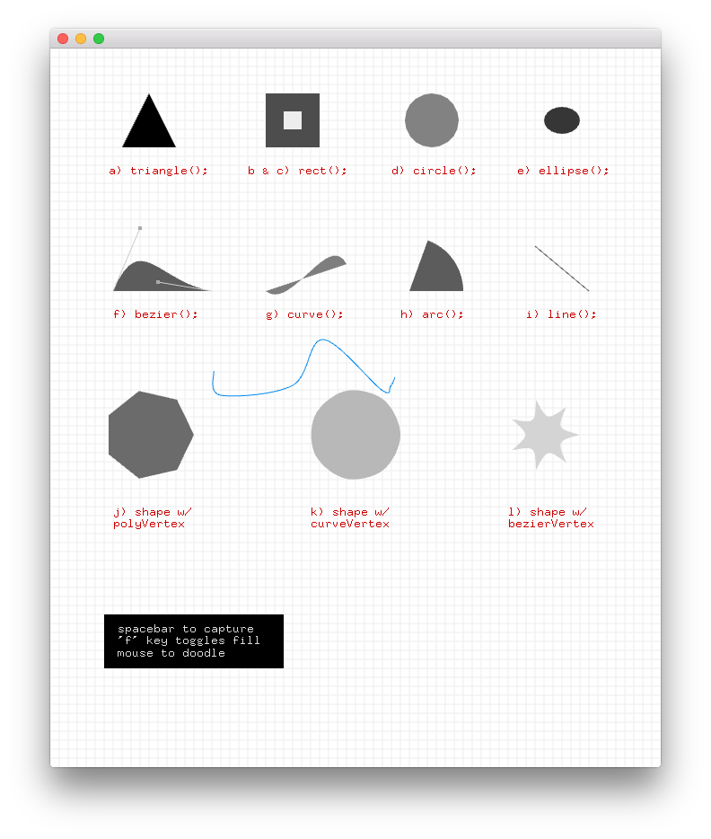

xmlSettingsExample

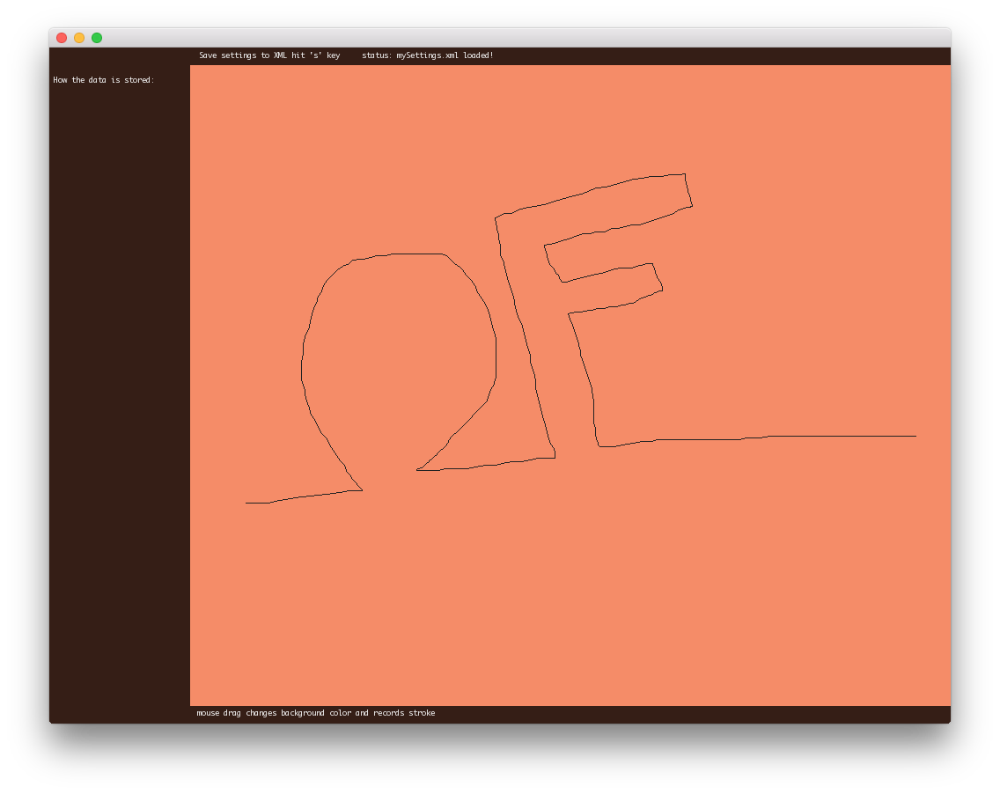
