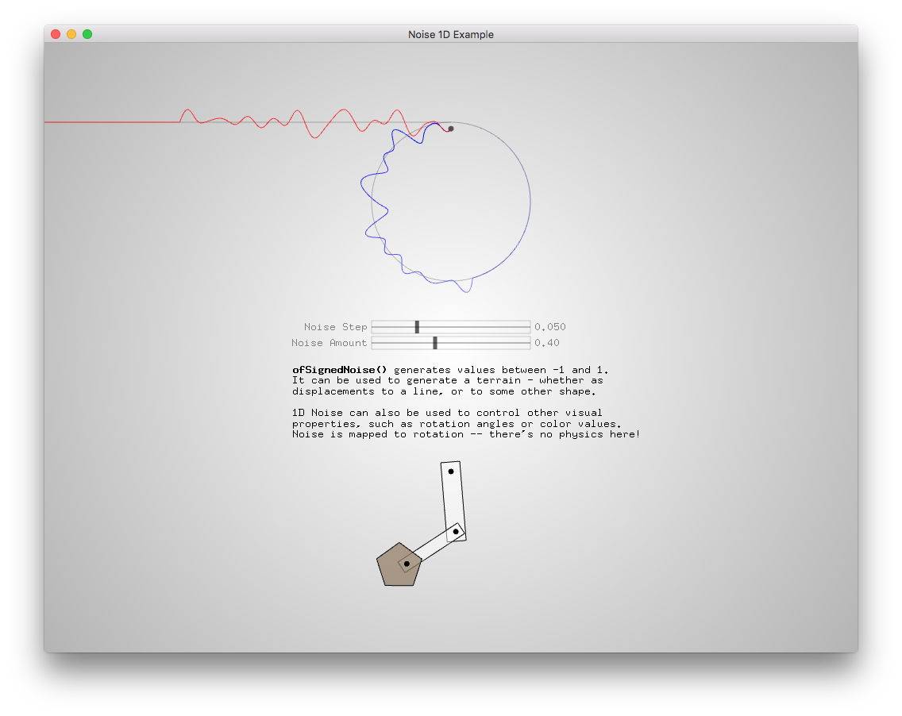
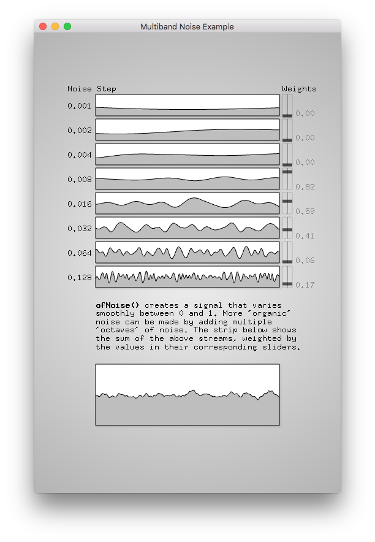
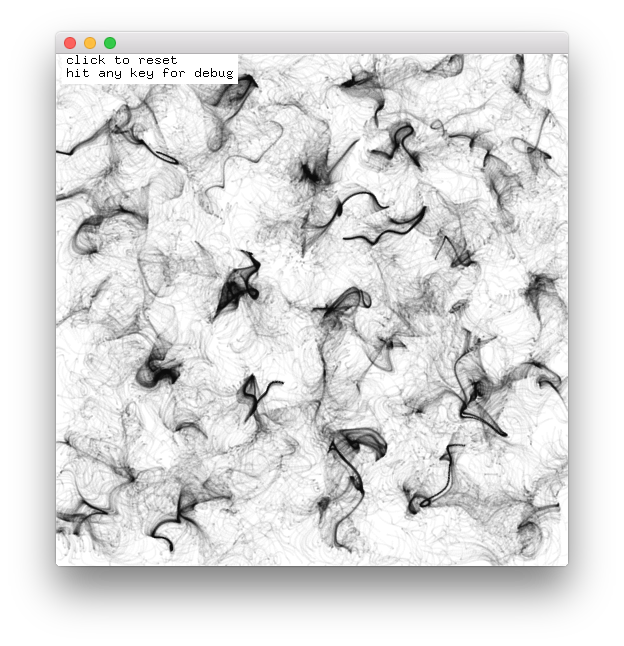
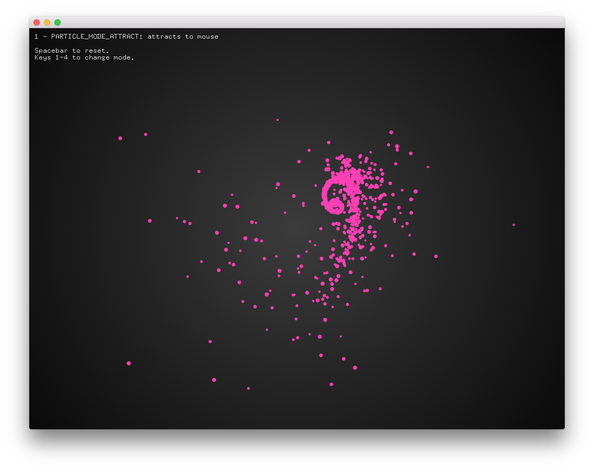
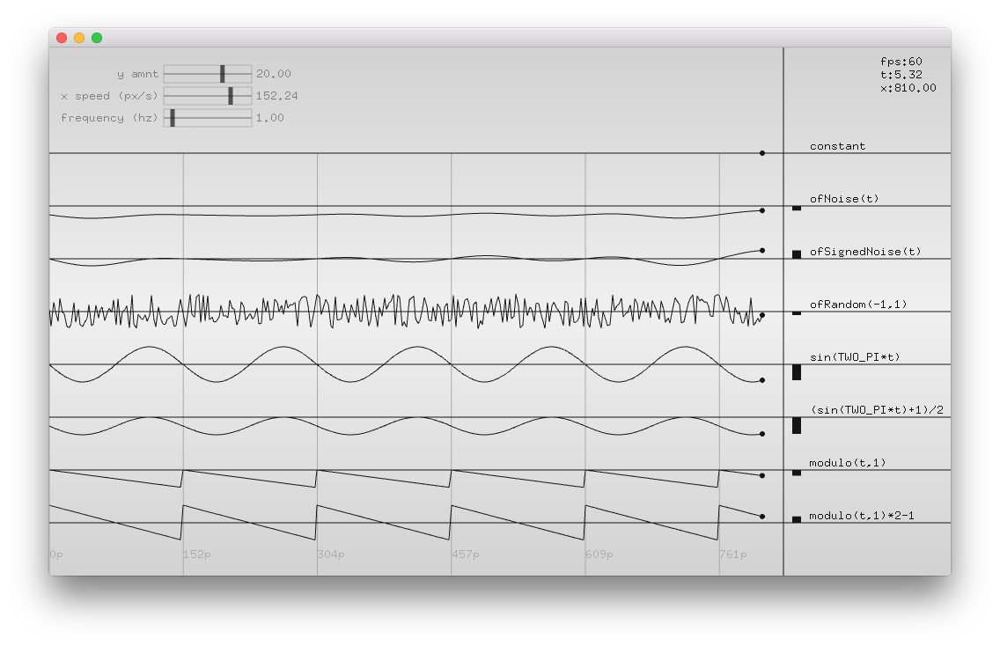
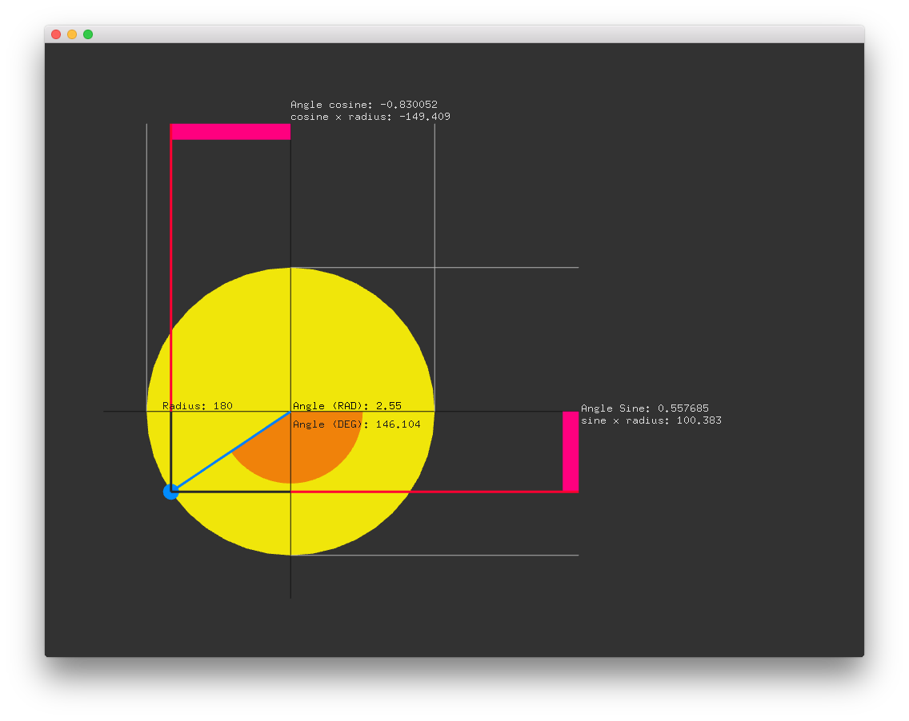
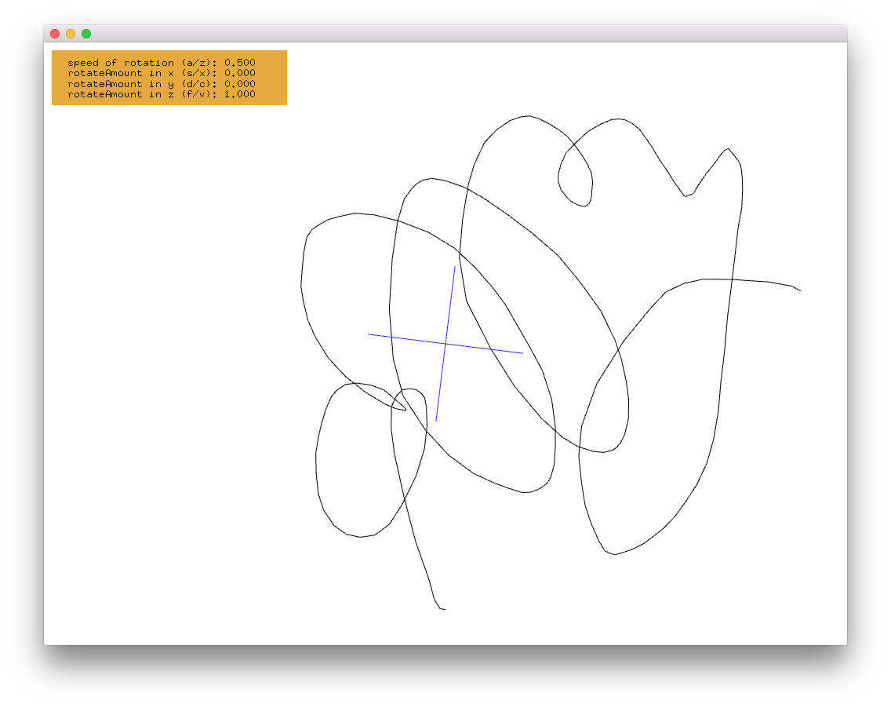

[< back to main](../README.md)

#examples/math

noise1dExample

noise1dOctaveExample

noiseField2dExample

particlesExample

periodicSignalsExample

trigonometricMotionExample

trigonometryExample

vectorMathExample

